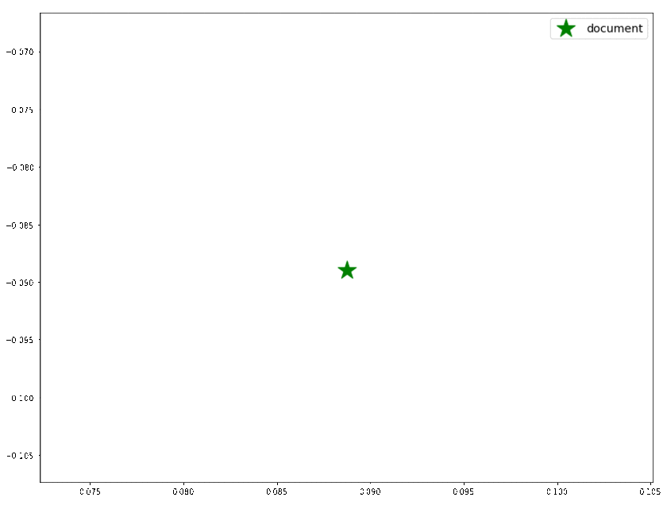

This is the implementation of the following paper: https://arxiv.org/abs/1801.04470

# Getting Started

## Download embeddings file `wiki_bigrams.bin`
You can find all these embeddings in original repo of [sent2vec](https://github.com/epfml/sent2vec#downloading-sent2vec-pre-trained-models)
Recently google drive has blocked `gdrive` and it's hard to get files from drive. I found these files on s3 
and you can download them easily from these links: 

- https://s3.amazonaws.com/epfml-sent2vec-models/wiki_bigrams.bin
- https://s3.amazonaws.com/epfml-sent2vec-models/wiki_unigrams.bin
- https://s3.amazonaws.com/epfml-sent2vec-models/twitter_bigrams.bin
- https://s3.amazonaws.com/epfml-sent2vec-models/twitter_unigrams.bin

to download wiki_bigrams.bin just run
```bash
wget https://s3.amazonaws.com/epfml-sent2vec-models/wiki_bigrams.bin
```

## docker-compose parameters
Flask api running on port 5000 will be mapped to outer 5000 port.
Model file downloaded in root directory 'wiki_bigrams.bin' will be mapped inside container in directory
`/sent2vec/pretrained_model.bin`

```yaml
version: '3.7'
services:
  embedrank_serving:
    container_name: embedrank_serving
    build: .
    ports:
      - "5000:5000"
    volumes:
      - "./wiki_bigrams.bin:/sent2vec/pretrained_model.bin"
```


## Running Docker Container
Probably the easiest way to get started is by using the provided Docker image.
From the project's root directory, the image can be built and running like so:
```
$ docker-compose up --build -d
```
This can take a several minutes to finish.
Also, keep in mind that pre-trained sent2vec models will not be downloaded since each model is several GBs in size and don't forget to allocate enough memory to your docker container (models are loaded in RAM).

## Flask API (inside container)
This return for each text a tuple containing three lists:
1) The top N candidates (string) i.e keyphrases
2) For each keyphrase the associated relevance score
3) For each keyphrase a list of alias (other candidates very similar to the one selected
as keyphrase)

```python
from flask import Flask, jsonify, request

import launch

app = Flask(__name__)


@app.route("/", methods=['POST'])
def analyzer():
    data = request.json
    query = data.get("text", "")
    lang = data.get("lang", "en")
    top_n = int(data.get("n", 15))

    keywords = launch.extract_keyphrases(embedding_distrib=embedding_distributor, ptagger=pos_tagger,
                                         raw_text=query, N=top_n, lang=lang)

    return jsonify(keywords)


if __name__ == '__main__':
    embedding_distributor = launch.load_local_embedding_distributor()
    pos_tagger = launch.load_local_corenlp_pos_tagger()

    app.run(host='0.0.0.0', port=5000)
```

## Curl example to call API
 
You can simply query from terminal
```bash
curl --location --request POST 'http://0.0.0.0:5000/' \            
    --header 'Content-Type: application/json' \
    --data-raw '{"text": "Unsupervised Keyphrase Extraction using Sentence Embeddings.", "lang":"en", "n":10}'
```

Response
```bash
[["sentence embeddings","unsupervised keyphrase extraction"],[1.0,0.8930467367172241],[[],[]]]
```

## POST request from python
```python
import json
import requests

text = "sample text to extract keywords from"
top_n = 15
lang = "en"

url = f"http://0.0.0.0:5000/"
data = {"text": "Unsupervised Keyphrase Extraction using Sentence Embeddings.", "lang":"en", "n":10}
result = requests.post(url, json=data)
content = json.loads(result.content)

keywords = content[0]
relevance_scores = content[1]
aliases = content[2]
```

## languages supported
- de
- en
- fr

# Method

This is the implementation of the following paper:
https://arxiv.org/abs/1801.04470



By using sentence embeddings , EmbedRank embeds both the document and candidate phrases into the same embedding space.

N candidates are selected as keyphrases by using Maximal Margin Relevance using the cosine similarity between the candidates and the
document in order to model the informativness and the cosine
similarity between the candidates is used to model the diversity.

An hyperparameter, beta (default=0.55), controls the importance given to 
informativness and diversity when extracting keyphrases.
(beta = 1 only informativness , beta = 0 only diversity)
You can change the beta hyperparameter value when calling extract_keyphrases:

```
kp1 = launch.extract_keyphrases(embedding_distributor, pos_tagger, raw_text, 10, 'en', beta=0.8)  #extract 10 keyphrases with beta=0.8

```

If you want to replicate the results of the paper you have to set beta to 1 or 0.5 and turn off the alias feature by specifiying alias_threshold=1 to extract_keyphrases method.
